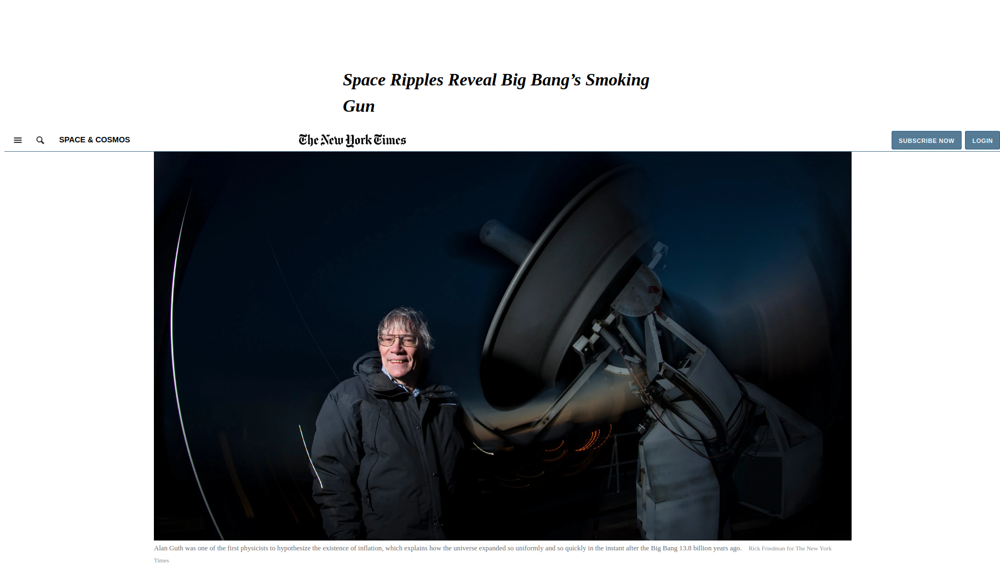

# New-York-Times-Article-clone-

**This Page is a clone of a the New York Times article**

# Getting started :
this webpage can be viewed better on the screen size of 1920 X 1080 in Mozilla firefox browser.
you can also download the repo and open the "index.html" file with Mozilla Firefox or Google Chrome.

The purpose of this project is to create a similar looking webpage like the New York Times Article webpage, using pure HTML & CSS.

To visit the page go to the [Live Demo Link](https://ixboy.github.io/New-York-Times-Article-clone-/)

# Prerequisites :

1- a Computer.

2 - An internet browser.

## BUILT WITH

    -HTML
    -CSS

## LIVE DEMO

[Live Demo Link](https://ixboy.github.io/New-York-Times-Article-clone-/)

##  AUTHORS

👤 **Widzmarc Jean Nesly Phelle**

- GitHub: [@widzthedvloper](https://github.com/widzthedvloper)
- Twitter: [@widzthedvloper](https://twitter.com/widzthedvloper)
- LinkedIn: [widzthedvloper](https://www.linkedin.com/in/widzmarc-jean-nesly-phelle-252a26129/)

👤 **Iyunda Ismael Antonio**

- GitHub: [@ixboy](https://github.com/ixboy)
- Twitter: [@ismaelixboy](https://twitter.com/ismaelixboy)
- LinkedIn: [Ismael Antonio](https://www.linkedin.com/in/ismael-antonio-0b7712114/)

## SHOW YOUR SUPPORT

**Give a \* if you like the project**

## 🤝 Contributing

Contributions, issues, and feature requests are welcome!

Feel free to check the issues page. Show your support

Give a ⭐️ if you like this project!

## 📝 Licensed MIT
